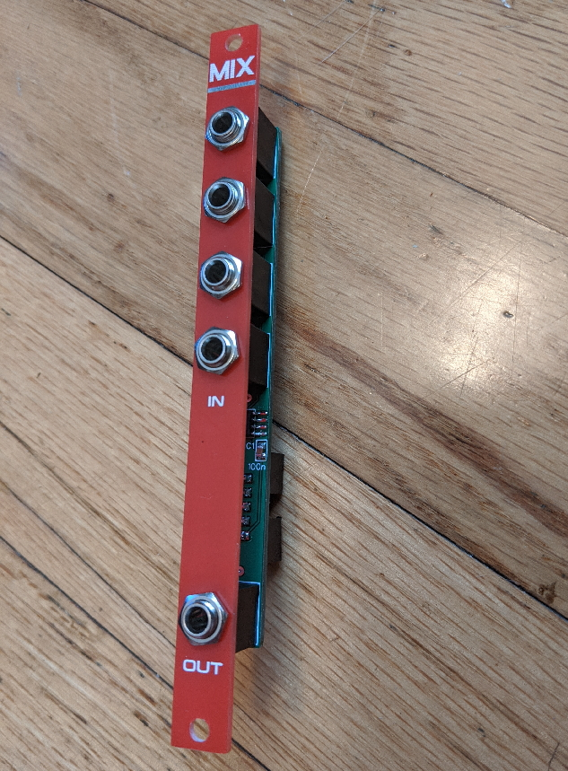

# Mix

This is a dead-simple 4-input mixer in 2HP. It is built with 0805 size passives and an SOIC dual op amp.

## BOM

| Qty | Designator | Part | Notes |
| --- | --- | ---- | ----- |
|   7 | R1, R2, R3, R4, R5, R6, R7 | 100k resistor 0805 |
|   1 | R8 | 330R resistor 0805 | Output protection, anything from 100 to 1k is fine.
|   2 | C1, C2 | 100nF capacitor 0805 |
|   1 | U1 | TL072 SOIC |
|   5 | J1, J2, J3, J4, J5 | Thonkiconn jacks |
|   1 | J6 | 10-pin shrouded header | Use nonpolarized header at your own risk

## License

* You are free to build this design, modify it, and use parts of it in other designs.
* Most PCB fabs have a minimum order of 5 units. You may sell excess PCBs as bare PCBs, kits, or fully assembled modules. Just don't order extras with the intent of selling them.
* If you make substantial changes to the design, then you may treat the design as your own. For example, adding features, removing features, or changing the form factor. Changing the font on the panel and other superficial changes would not count.
* I urge you to release any derivative works under similar terms, but you don't have to.
